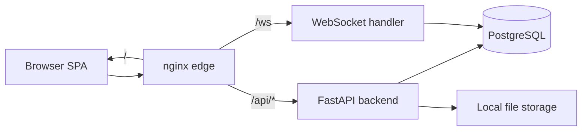

# Architecture

High-level system design for QuizArena. For the full specification see [SYSTEM_ARCHITECTURE.md](./SYSTEM_ARCHITECTURE.md) and [PROJECT_SPEC.md](./PROJECT_SPEC.md).

## Components



## Frontend routes

| Path prefix | Role |
|-------------|------|
| `/admin/*` | Quiz builder, live room control, results |
| `/display/:secretToken` | Presentation / projector view |
| `/join`, `/lobby`, `/quiz`, `/results` | Participant experience |

Route bundles are lazy-loaded (`AdminRoutes`, `DisplayRoutes`, `ParticipantRoutes`) to keep initial bundle small.

## Backend layers

```
app/
├── api/routers/     REST handlers (versioned under /api/v1)
├── api/websocket/   Unified /ws endpoint with role-based auth
├── services/        Business logic (quiz execution, scoring, timers)
├── models/          SQLAlchemy ORM
├── repositories/    Data access
└── core/            Middleware, security, logging, rate limits
```

## Real-time model

- Single WebSocket endpoint at `/ws` with query params: `role`, `token`, `roomId` / `secretToken`.
- Server pushes room state, question transitions, leaderboard updates.
- Clients send answers and heartbeats; server validates via session tokens or admin JWT.
- See [SOCKET_EVENTS.md](./SOCKET_EVENTS.md) for the event catalog.

## Data store

- **PostgreSQL** in production (Docker Compose, CI, deployed environments).
- **SQLite** for lightweight local development and unit/integration tests.
- Schema managed by **Alembic** migrations in `backend/alembic/versions/`.

## Deployment topology (production)

| Service | Image | Role |
|---------|-------|------|
| `nginx` | nginx:alpine | TLS termination, reverse proxy, rate limits |
| `frontend` | custom (Node build → nginx) | Static SPA |
| `backend` | custom (Python 3.12) | API + WebSocket |
| `db` | postgres:16 | Primary database |

Persistent volumes: PostgreSQL data, uploaded media (`storage_data`).

## Security

- Admin JWT (Bearer) for protected REST and admin WebSocket connections.
- Participant session tokens scoped to a live room.
- Display secret tokens for read-only presentation access.
- Rate limiting on login and join (application + nginx edge).
- Production requires strong `JWT_SECRET_KEY`, non-wildcard CORS, and PostgreSQL.

## Related documents

- [DATABASE_SCHEMA.md](./DATABASE_SCHEMA.md)
- [API_SPEC.md](./API_SPEC.md)
- [Deployment.md](./Deployment.md)
