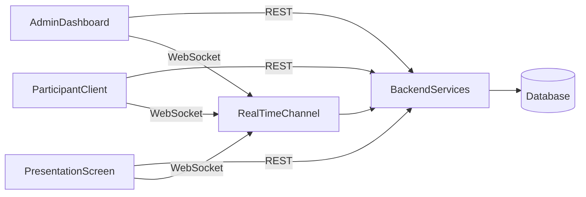
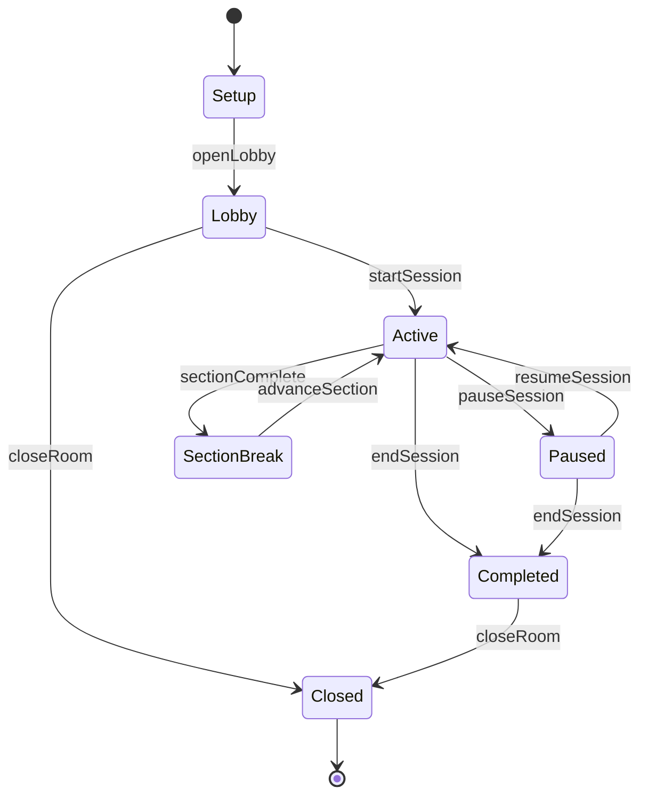
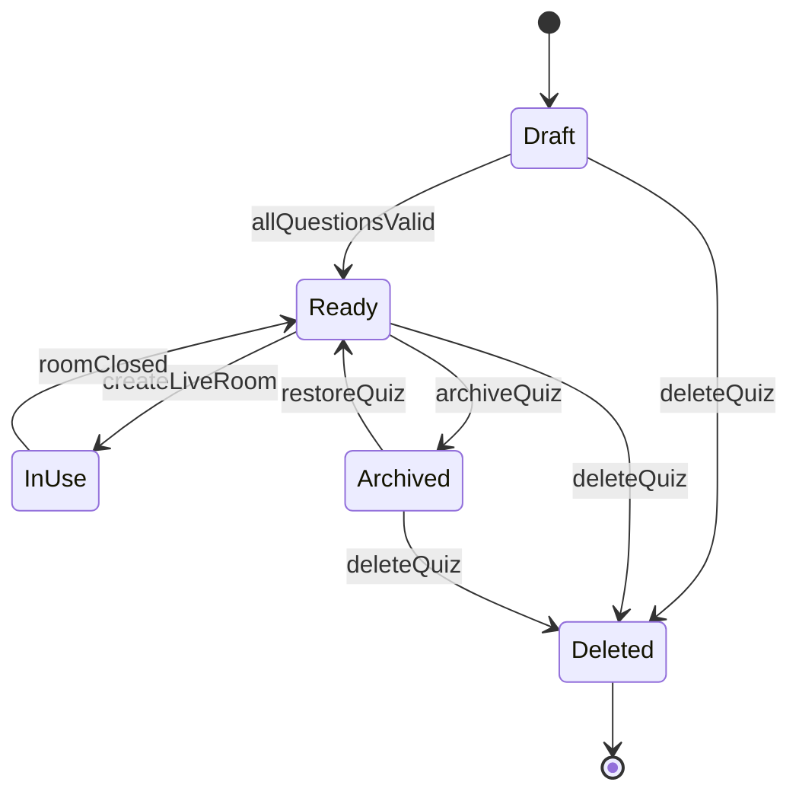
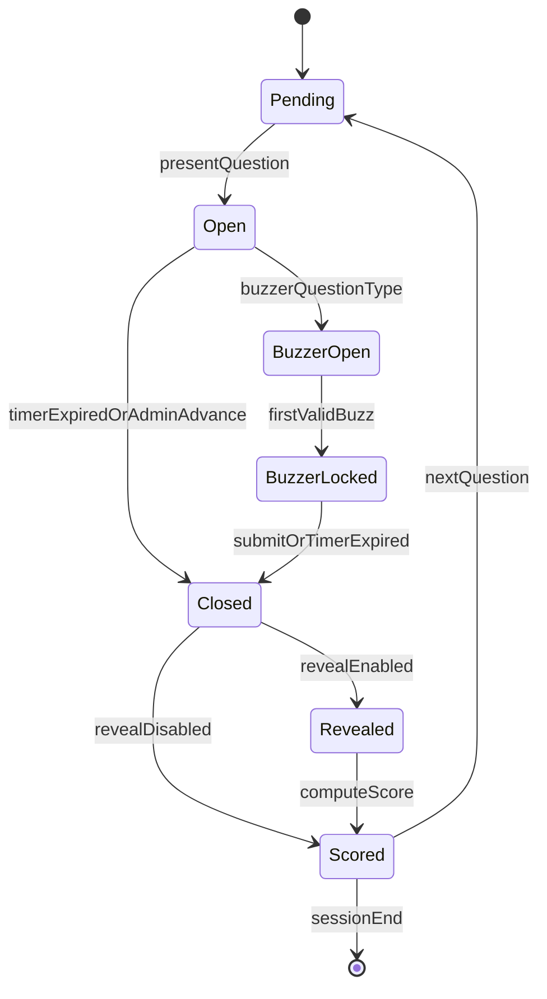
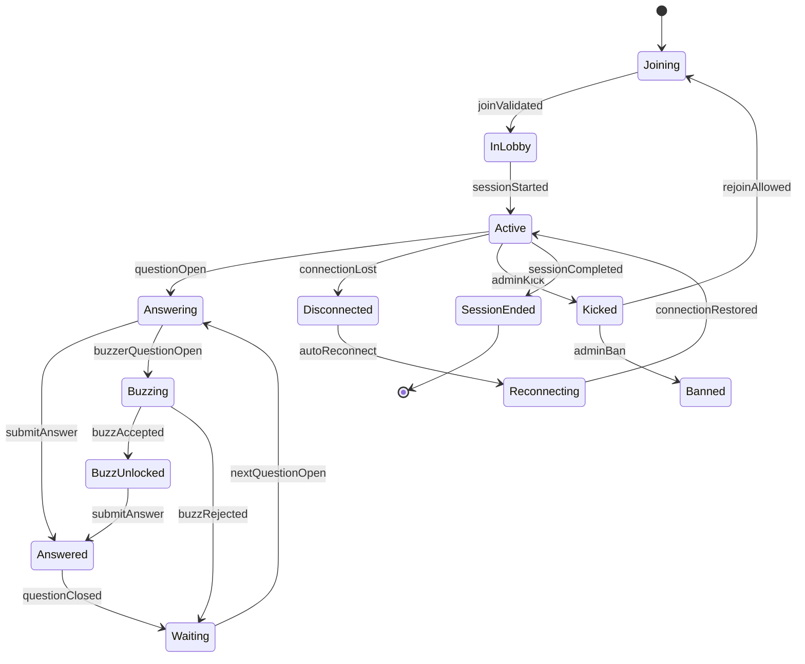

# QuizArena — Software Requirements Specification (SRS)

| Field | Value |
|-------|-------|
| **Document Title** | QuizArena — Software Requirements Specification |
| **Version** | 1.1 |
| **Status** | Draft for Review |
| **Date** | July 31, 2026 |
| **Prepared By** | Software Architecture Team |

---

## Table of Contents

1. [Introduction](#1-introduction)
2. [Purpose](#2-purpose)
3. [Scope](#3-scope)
4. [Objectives](#4-objectives)
5. [User Roles](#5-user-roles)
6. [Functional Requirements](#6-functional-requirements)
7. [Non-Functional Requirements](#7-non-functional-requirements)
8. [User Stories](#8-user-stories)
9. [Assumptions](#9-assumptions)
10. [Constraints](#10-constraints)
11. [Future Scope](#11-future-scope)
12. [Scoring Rules](#12-scoring-rules)
13. [State Models](#13-state-models)
14. [Success Metrics](#14-success-metrics)
15. [Appendix A — Glossary](#appendix-a--glossary)
16. [Appendix B — Open Decisions Resolved by Default](#appendix-b--open-decisions-resolved-by-default)

---

## 1. Introduction

QuizArena is a production-ready, real-time quiz platform designed for live interactive events across education, corporate, and public entertainment contexts. The platform enables a host to create quiz content, open a live session room, and run a synchronized quiz experience for an audience of participants — all without requiring participants to create accounts.

The application consists of three synchronized clients that share a unified backend and real-time communication layer:

| Client | Primary Users | Primary Device Context |
|--------|---------------|------------------------|
| **Admin Dashboard** | Quiz administrator | Desktop and mobile browsers |
| **Participant Client** | Quiz players | Desktop and mobile browsers |
| **Presentation Screen** | Audience / room display | TVs, projectors, and large-format displays |

All three clients are web-based and communicate with a shared backend through REST APIs for transactional operations and WebSockets (via Socket.IO) for real-time synchronization.

**Approved Technology Stack (Summary):**

| Layer | Technology |
|-------|------------|
| Frontend | React, TypeScript, Tailwind CSS |
| Backend | FastAPI |
| Database (Development) | SQLite |
| Database (Production) | PostgreSQL |
| Communication | REST APIs; Socket.IO / WebSockets |

All technologies used in QuizArena must be free and open-source.

---

## 2. Purpose

This Software Requirements Specification defines the functional and non-functional requirements for QuizArena version 1.0. It establishes a shared, authoritative understanding of **what the system shall do** and **what quality attributes it shall meet**, without prescribing implementation details.

**Intended Audience:**

- Product owners and stakeholders
- UX and visual designers
- Software engineers (frontend, backend, and infrastructure)
- Quality assurance engineers
- Operations and support personnel

This document serves as the contractual baseline for system design, development, testing, and acceptance. All design decisions, user interface work, and engineering implementations shall trace back to requirements stated herein.

---

## 3. Scope

### 3.1 In Scope

The following capabilities are within the scope of QuizArena v1.0:

- JWT-based authentication for a single administrator account
- Quiz lifecycle management: create, read, update, delete, archive, and duplicate
- Question lifecycle management supporting four question types: Text, Image, Audio, and Buzzer
- Questions organized into configurable sections/rounds within a quiz
- Live room creation, hosting, and full session lifecycle management
- Participant join via QR code scan or manual 6-character alphanumeric room code entry
- Participant identification via display name and email address (no participant accounts)
- Real-time synchronization of room state, questions, timers, scores, and leaderboard across all three clients
- Live leaderboard — always enabled, updated after every question, visible on all three clients
- Real-time participant monitoring for the administrator
- Configurable scoring: fixed points, time-based bonus, and streak bonus (all configurable per quiz)
- Buzzer-style competitive question type with first-responder mechanics
- Quiz preview mode for solo administrator testing before going live
- Session and results export in CSV and Excel formats
- Full session history browsable from the Admin Dashboard
- Individual and bulk deletion of session and participant data
- Responsive Admin Dashboard and Participant Client (desktop and mobile with equal priority)
- Presentation Screen optimized for TVs and projectors with branding support
- Platform-wide and per-quiz branding assets for the Presentation Screen

### 3.2 Out of Scope

The following are explicitly excluded from QuizArena v1.0:

- Multiple administrator accounts or differentiated admin roles
- In-app administrator account creation or self-registration
- Participant user accounts, social login, or persistent player profiles
- Free-text answer input and auto-grading (multiple-choice only for v1)
- Paid tiers, billing, or subscription management
- Native mobile applications (iOS / Android)
- Offline or disconnected play modes
- AI-generated questions or document import
- Multi-organization / multi-tenant isolation
- Advanced analytics dashboards beyond live monitoring, session history, and export
- Formal WCAG certification (basic accessibility practices apply; see NFR-043)
- Multiple concurrent live rooms actively hosted by the administrator simultaneously
- In-app administrator password recovery
- Dark mode or user-configurable themes
- Formal uptime SLA or error alerting infrastructure
- Negative marking (point deductions for incorrect answers)

### 3.3 System Context



---

## 4. Objectives

QuizArena v1.0 shall achieve the following measurable objectives:

| ID | Objective |
|----|-----------|
| **OBJ-001** | An administrator shall be able to prepare and launch a live quiz session in under 10 minutes from login to lobby open. |
| **OBJ-002** | Participants shall be able to join a live room in under 30 seconds via QR code or room code without creating an account. |
| **OBJ-003** | Real-time events (joins, answers, score updates, leaderboard changes, room state transitions) shall reach all subscribed clients within 1 second under normal load conditions. |
| **OBJ-004** | The platform shall support up to 5 concurrent live rooms and up to 100 participants per room without degradation against OBJ-003. |
| **OBJ-005** | The live leaderboard shall update on the Admin Dashboard, Participant Client, and Presentation Screen after every question without exception. |
| **OBJ-006** | The Presentation Screen shall provide a legible, branded, full-format display suitable for audiences viewing from typical event-venue distances. |
| **OBJ-007** | All core workflows shall function on modern desktop and mobile browsers with equal design priority across Admin Dashboard and Participant Client. |
| **OBJ-008** | The platform shall use exclusively free and open-source technologies, incurring no software licensing costs. |

---

## 5. User Roles

### 5.1 Administrator

There is exactly one administrator account for the platform in v1.0. The administrator account is provisioned manually during platform setup; there is no in-app account creation flow.

**Capabilities:**

- Authenticate via JWT-secured login
- Create, edit, archive, duplicate, and delete quizzes and questions
- Preview a quiz in solo mode before hosting a live session
- Create and control one live room at a time
- Open and close the participant lobby
- Start, pause, resume, skip, and end live sessions
- Monitor participants in real time (presence, responses, activity)
- Remove (kick) participants and optionally ban their email from rejoining the current room
- Export session data in CSV and Excel formats at any point during or after a session
- Browse full session history and delete individual or bulk session records
- Configure per-quiz settings: scoring rules, question advance mode, answer reveal behavior, shuffle options

**Restrictions:**

- The administrator may actively host and control only one live room at a time in v1.0
- All quizzes belong to a shared global library accessible to the administrator

### 5.2 Participant

Participants interact with the platform through the Participant Client only. No account, registration, or login is required.

**Capabilities:**

- Join a live room by scanning a QR code or entering a 6-character alphanumeric room code
- Provide a display name and email address to enter the lobby
- Wait in the lobby until the administrator starts the session
- View the current question synchronized with the Presentation Screen
- Submit answers using an explicit Submit action (multiple-choice questions)
- Use the buzzer control on Buzzer question types
- Change their selected answer before submitting or before the timer expires
- View the live leaderboard after every question
- View their final rank and score at session end
- Automatically reconnect and resume their session state after a transient disconnection

**Restrictions:**

- Display names must be unique within a room
- Email addresses must be unique within a room
- Disconnected or kicked/banned participants cannot rejoin if banned; otherwise rejoin restores prior score
- Participant email addresses are never visible to other participants or on the Presentation Screen

### 5.3 Presentation Screen Operator

The Presentation Screen is opened by the administrator (or a designated operator) via a secret share link tied to a specific live room. No authentication is required to view the Presentation Screen; access is controlled by possession of the secret link.

**Capabilities:**

- Display lobby/waiting state, current question, timer, answer reveal, section leaderboards, live leaderboard, and session-end podium
- Render quiz title, room code, platform logo, and optional per-quiz branding
- Operate in full-screen browser mode on TV and projector hardware

**Restrictions:**

- The Presentation Screen is read-only; all session control originates from the Admin Dashboard
- Participant email addresses are never displayed on the Presentation Screen

### 5.4 System (Implicit Role)

The system enforces authentication, authorization, input validation, scoring computation, real-time event broadcasting, and data persistence rules on behalf of all roles.

---

## 6. Functional Requirements

Requirements are identified by `FR-xxx` identifiers and grouped by functional domain. Each requirement uses **shall** phrasing to denote a mandatory system behavior.

### 6.1 Authentication and Authorization

| ID | Requirement |
|----|-------------|
| **FR-001** | The system shall authenticate the administrator using JWT-based credentials issued upon successful login with a valid username and password. |
| **FR-002** | The system shall reject all unauthenticated requests to administrator-only operations. |
| **FR-003** | The system shall issue JWT tokens valid for the duration of an administrator work session (approximately 8 hours) with no refresh token mechanism in v1. |
| **FR-004** | The system shall invalidate the JWT token upon administrator logout. |
| **FR-005** | The system shall enforce a strong password policy for the administrator account: minimum 8 characters with uppercase, lowercase, numeric, and special character requirements. |
| **FR-006** | The system shall store administrator credentials using industry-standard one-way password hashing; plaintext passwords shall never be stored or transmitted after initial setup. |
| **FR-007** | Participants shall not require accounts; access to live rooms shall be gated by a valid room code, QR-derived join token, or secret Presentation Screen link as applicable. |
| **FR-008** | The system shall log security events including successful login, logout, and failed authentication attempts. |

### 6.2 Quiz Management

| ID | Requirement |
|----|-------------|
| **FR-010** | The system shall allow the administrator to create quizzes with a title, description, and optional metadata. |
| **FR-011** | The system shall allow the administrator to view, search, and filter the global quiz library. |
| **FR-012** | The system shall allow the administrator to edit existing quizzes and their associated configuration settings. |
| **FR-013** | The system shall allow the administrator to delete quizzes that are not actively referenced by a live room; deletion of in-use quizzes shall require explicit confirmation or be blocked. |
| **FR-014** | The system shall allow the administrator to archive quizzes, removing them from the active library list while preserving their content and associated session history. |
| **FR-015** | The system shall allow the administrator to duplicate (clone) an existing quiz, including all questions, sections, and configuration settings. |
| **FR-016** | The system shall allow the administrator to preview a quiz in solo mode, stepping through questions without creating a live room or requiring participants. |
| **FR-017** | The system shall enforce a maximum of 100 questions per quiz in v1.0. |
| **FR-018** | The system shall not impose a practical upper limit on the number of quizzes in the library. |

**Per-Quiz Configuration Settings:**

| Setting | Options |
|---------|---------|
| Question advance mode | Manual (admin advances each question) or Automatic (advances on timer expiry) |
| Answer reveal behavior | Reveal after each question or withhold until session end |
| Time bonus | Enabled/disabled; bonus amount configurable |
| Streak bonus | Enabled/disabled; bonus rules configurable |
| Question order shuffle | Enabled/disabled |
| Answer option shuffle | Enabled/disabled |

### 6.3 Question Management

| ID | Requirement |
|----|-------------|
| **FR-020** | The system shall allow the administrator to add, edit, reorder, and remove questions within a quiz. |
| **FR-021** | The system shall allow the administrator to organize questions into named sections/rounds within a quiz. |
| **FR-022** | Each question shall support exactly one of four types: **Text**, **Image**, **Audio**, or **Buzzer**. |
| **FR-023** | Text questions shall present a written text prompt and support multiple-choice answer options with either a single correct answer or multiple correct answers, configurable per question. |
| **FR-024** | Image questions shall display an administrator-uploaded image as the prompt with optional caption text and multiple-choice answer options (single or multiple correct, configurable per question). |
| **FR-025** | Audio questions shall play an administrator-uploaded audio clip as the prompt with multiple-choice answer options (single or multiple correct, configurable per question). |
| **FR-026** | Buzzer questions shall present a prompt (text, image, or audio) and enable a first-to-respond competition; the first participant to submit a valid buzz shall be unlocked to select from the answer options; all other participants' buzz attempts shall be rejected. |
| **FR-027** | The buzzer shall close immediately upon the first valid buzz; no further buzz attempts shall be accepted for that question. |
| **FR-028** | Each question shall support an optional configurable time limit and a configurable base point value. |
| **FR-029** | Each multiple-choice question shall support a minimum of 2 and a maximum of 6 answer options. |
| **FR-030** | The system shall validate question completeness (prompt, answer options, correct answer designation, point value) before a quiz can be used in a live room or preview mode. |
| **FR-031** | Free-text answer input shall not be supported in v1.0; all auto-graded questions shall use multiple-choice format. |

**Question Type Behavior Summary:**

| Type | Prompt Medium | Participant Interaction | Scoring |
|------|---------------|------------------------|---------|
| **Text** | Written text | Select one or more answer options; explicit Submit | Correctness + optional time bonus + optional streak bonus |
| **Image** | Uploaded image + optional caption | Select one or more answer options; explicit Submit | Same as Text |
| **Audio** | Uploaded audio clip | Select one or more answer options; explicit Submit | Same as Text; audio playback controls on all clients |
| **Buzzer** | Text, image, or audio prompt | Buzz button; first valid buzz unlocks answer options for that participant only; explicit Submit | Same scoring rules applied to the unlocked participant's submitted answer |

**Media Asset Requirements:**

| Asset Type | Supported Formats | Maximum Size |
|------------|-------------------|--------------|
| Image | JPEG, PNG, WebP | 5 MB |
| Audio | MP3, WAV | 15 MB |

### 6.4 Live Room Management

| ID | Requirement |
|----|-------------|
| **FR-040** | The system shall allow the administrator to create a live room linked to a selected quiz, generating a unique 6-character alphanumeric room code and a corresponding join QR code. |
| **FR-041** | The system shall generate a secret share link for the Presentation Screen tied to the live room. |
| **FR-042** | A live room shall progress through defined states as specified in [Section 13.1 — Room States](#131-room-states). |
| **FR-043** | The administrator shall open the lobby to accept participant joins and may prevent new entrants by closing the lobby without ending the session. |
| **FR-044** | The administrator shall manually start the session from the lobby when ready; the system shall not auto-start sessions. |
| **FR-045** | The administrator shall pause, resume, skip, and end the live session at any point during the Active state. |
| **FR-046** | When paused, the system shall freeze the question timer, block answer submissions, and hold all current question state until resumed. |
| **FR-047** | The administrator shall advance questions manually or allow automatic advancement on timer expiry, per the quiz's configured advance mode. |
| **FR-048** | The system shall synchronize room state, current question, section context, timers, scores, and leaderboard across the Admin Dashboard, Participant Client, and Presentation Screen in real time. |
| **FR-049** | Room codes and QR codes shall expire when the session ends (Completed or Closed state); they shall not be reusable across sessions. |
| **FR-050** | The system shall persist all session results, participant responses, and scores before marking a room as Completed. |
| **FR-051** | The administrator shall actively host and control only one live room at a time in v1.0. |

### 6.5 Participant Join Flow

| ID | Requirement |
|----|-------------|
| **FR-060** | Participants shall join by scanning a QR code that resolves to the Participant Client with the room pre-identified. |
| **FR-061** | Participants shall join by manually entering the 6-character alphanumeric room code on the Participant Client. |
| **FR-062** | Before entering the lobby, participants shall provide a **display name** and **email address**; both fields are mandatory. |
| **FR-063** | The system shall validate email address format and reject email addresses already registered within the same room. |
| **FR-064** | The system shall reject duplicate display names within the same room. |
| **FR-065** | Participants shall see a lobby/waiting view after joining until the administrator starts the session. |
| **FR-066** | The system shall display clear, user-friendly error messages for invalid, expired, or closed room codes. |
| **FR-067** | Participants who disconnect mid-session shall be able to rejoin the same room using the same display name and email and resume their existing score and progress. |
| **FR-068** | Participants who have been kicked and banned by the administrator shall not be able to rejoin the same room. |

### 6.6 Live Gameplay

| ID | Requirement |
|----|-------------|
| **FR-070** | During an active session, all clients shall display the current question synchronized with the server-authoritative state. |
| **FR-071** | Participants shall select answer options and submit their answer using an explicit Submit action. |
| **FR-072** | Participants shall be able to change their selected answer after selection but before submitting or before the question timer expires, whichever comes first. |
| **FR-073** | Unsubmitted answers when the timer expires shall be recorded as unanswered (no response). |
| **FR-074** | For Buzzer questions, participants shall use a dedicated on-screen buzzer control; the system shall provide immediate feedback on whether the buzz was accepted or rejected. |
| **FR-075** | The system shall calculate scores according to the rules defined in [Section 12 — Scoring Rules](#12-scoring-rules). |
| **FR-076** | Multiple-correct-answer questions shall use all-or-nothing scoring: full points are awarded only when all correct options are selected and no incorrect options are selected. |
| **FR-077** | The administrator shall view, in real time, which participants have submitted an answer for the current question and the overall participation status of all connected participants. |
| **FR-078** | Correct answer reveal timing shall follow the quiz's configured reveal behavior (after each question or withheld until session end). |
| **FR-079** | At the end of each section, the Presentation Screen shall display a section-level leaderboard before the next section begins. |
| **FR-080** | Section transitions shall require explicit administrator advancement; the system shall pause at section boundaries until the administrator proceeds. |

### 6.7 Leaderboard

| ID | Requirement |
|----|-------------|
| **FR-090** | The system shall maintain a live leaderboard ranking all participants by total score throughout the session. |
| **FR-091** | The live leaderboard is a core platform feature and shall **always be enabled**; it cannot be disabled, hidden, or restricted by configuration in v1.0. |
| **FR-092** | The live leaderboard shall be visible on the Admin Dashboard, Participant Client, and Presentation Screen. |
| **FR-093** | The live leaderboard shall update after every question and reflect changes in ranking, score, and position for all participants. |
| **FR-094** | Leaderboard updates shall be delivered to all subscribed clients in real time via WebSockets within the latency defined in NFR-001. |
| **FR-095** | Tied scores shall be broken by ranking the participant who answered correctly first higher; if the tie persists, shared rank numbering shall apply (e.g., two participants at rank 2, next participant at rank 4). |
| **FR-096** | At session end, the Presentation Screen shall display a podium view highlighting the top three participants; all participants shall see their final rank and score on the Participant Client. |

### 6.8 Real-Time Participant Monitoring

| ID | Requirement |
|----|-------------|
| **FR-100** | The administrator shall see a live list of all connected participants showing: display name, email address, join time, connection status, and current activity state as defined in [Section 13.4 — Participant States](#134-participant-states). |
| **FR-101** | Participant email addresses shall be visible to the administrator only; they shall never be displayed on the Presentation Screen or to other participants. |
| **FR-102** | The administrator shall remove (kick) a participant from an active room. |
| **FR-103** | When removing a participant, the administrator shall optionally ban the participant's email address from rejoining the current room session. |
| **FR-104** | The system shall detect participant disconnections and reconnections and reflect updated connection status in the monitoring view within a reasonable interval. |
| **FR-105** | Upon automatic reconnection, the Participant Client shall resynchronize to the current server state without requiring the participant to re-enter the room code. |

### 6.9 Presentation Screen

| ID | Requirement |
|----|-------------|
| **FR-110** | The Presentation Screen shall be accessible via a secret share link tied to a specific live room; no authentication shall be required. |
| **FR-111** | The Presentation Screen shall render high-contrast, large-format layouts optimized for viewing on TVs and projectors at typical event-venue distances. |
| **FR-112** | The Presentation Screen shall support full-screen browser mode. |
| **FR-113** | The Presentation Screen shall display the following modes as driven by session state: lobby/waiting, question view with timer, answer reveal, section leaderboard, live leaderboard, and session-end podium. |
| **FR-114** | The Presentation Screen shall display the quiz title, room code, platform logo, and optional per-quiz branding assets. |
| **FR-115** | Branding shall support a platform-wide default logo with optional per-quiz override uploaded by the administrator. |
| **FR-116** | The Presentation Screen shall not expose administrator controls or participant email addresses. |
| **FR-117** | Image and audio media content shall render reliably on large-format displays with visible playback controls where applicable. |

### 6.10 Export and Session History

| ID | Requirement |
|----|-------------|
| **FR-120** | The administrator shall export session data in **CSV** format. |
| **FR-121** | The administrator shall export session data in **Excel** format (.xlsx). |
| **FR-122** | Exports shall include detailed per-question data: participant name, email, per-question response, correctness, points earned per question, timestamps, and final rank. |
| **FR-123** | Exports shall be available at any point during an active live session and after session completion. |
| **FR-124** | Export files shall reflect the same persisted data shown in the Admin Dashboard session results view. |
| **FR-125** | The administrator shall browse full session history from the Admin Dashboard, including past session metadata, participant lists, and results. |
| **FR-126** | The administrator shall delete individual session records and all associated participant data. |
| **FR-127** | The administrator shall bulk-delete multiple session records and all associated participant data. |

### 6.11 Cross-Client Responsiveness and Theming

| ID | Requirement |
|----|-------------|
| **FR-130** | The Admin Dashboard and Participant Client shall provide fully functional, equivalent layouts on desktop and mobile screen sizes. |
| **FR-131** | The Presentation Screen shall function on common smart TV browsers and HDMI-connected display device browsers. |
| **FR-132** | All clients shall use a light visual theme in v1.0. |
| **FR-133** | The user interface shall be built with an internationalization-ready architecture; v1.0 shall ship with English as the sole supported language. |

---

## 7. Non-Functional Requirements

Requirements are identified by `NFR-xxx` identifiers.

### 7.1 Performance

| ID | Requirement |
|----|-------------|
| **NFR-001** | Real-time events (participant joins, answer submissions, score updates, leaderboard changes, room state transitions) shall reach all subscribed clients within **1 second** under normal load (up to 5 concurrent rooms, up to 100 participants per room). |
| **NFR-002** | REST API read operations for administrator list views shall respond within **500 ms** at the 95th percentile under normal conditions. |
| **NFR-003** | QR code and room code generation shall complete within **1 second** of live room creation. |

### 7.2 Availability and Reliability

| ID | Requirement |
|----|-------------|
| **NFR-010** | The production deployment shall operate on a best-effort availability basis for v1.0; no formal uptime SLA is required. |
| **NFR-011** | The system shall recover gracefully from transient WebSocket disconnections via automatic client reconnection and server-state resynchronization. |
| **NFR-012** | Session scores, participant responses, and room state shall be persisted to the database before a room transitions to the Completed state; no in-memory-only result storage. |

### 7.3 Security

| ID | Requirement |
|----|-------------|
| **NFR-020** | All production traffic shall be encrypted via HTTPS. |
| **NFR-021** | JWT signing secrets and administrator credentials shall never be exposed to client applications beyond the issued token. |
| **NFR-022** | Uploaded media files shall be validated for permitted file type and size on the server side; files failing validation shall be rejected. |
| **NFR-023** | Rate limiting shall protect the administrator login endpoint and participant join endpoints from abuse. |
| **NFR-024** | The Presentation Screen secret link shall be of sufficient entropy to prevent unauthorized access through URL guessing during an active session window. |
| **NFR-025** | Participant email addresses shall be collected solely for session identification, administrator monitoring, and export; the platform shall not send marketing or notification emails to participants in v1.0. |

### 7.4 Scalability

| ID | Requirement |
|----|-------------|
| **NFR-030** | The production architecture shall support horizontal scaling of stateless API and real-time communication layers with PostgreSQL as the shared persistent data store. |
| **NFR-031** | The platform shall support up to **5 concurrent live rooms** and up to **100 participants per room** without performance degradation against NFR-001. |

### 7.5 Usability

| ID | Requirement |
|----|-------------|
| **NFR-040** | The participant join flow shall require no more than **3 screens** from initial landing to lobby entry. |
| **NFR-041** | Admin Dashboard workflows shall follow consistent navigation patterns across desktop and mobile layouts. |
| **NFR-042** | Presentation Screen typography, spacing, and color contrast shall prioritize legibility at viewing distances typical of event venues and classrooms. |
| **NFR-043** | The platform shall implement basic accessibility practices: semantic HTML structure, keyboard navigability for interactive elements, and sufficient color contrast ratios. |

### 7.6 Compatibility

| ID | Requirement |
|----|-------------|
| **NFR-050** | All clients shall support the latest two major versions of Chrome, Firefox, Safari, and Edge on desktop and mobile platforms. |
| **NFR-051** | Unsupported browsers shall display a clear compatibility notice rather than a broken experience. |

### 7.7 Maintainability and Operations

| ID | Requirement |
|----|-------------|
| **NFR-060** | All platform components shall use the approved open-source technology stack exclusively. |
| **NFR-061** | The platform shall use SQLite for local development and PostgreSQL for production, with environment-driven configuration for database selection. |
| **NFR-062** | The production deployment shall expose a health check endpoint suitable for load balancer and monitoring integration. |
| **NFR-063** | The platform shall produce structured application logs for operational diagnostics. |

### 7.8 Data Integrity and Retention

| ID | Requirement |
|----|-------------|
| **NFR-070** | Session data and participant records shall be retained indefinitely until explicitly deleted by the administrator. |
| **NFR-071** | Deletion of session records (individual or bulk) shall permanently remove all associated participant data from the platform. |
| **NFR-072** | Export files shall be consistent with persisted database records at the time of export generation. |

---

## 8. User Stories

### 8.1 Administrator

| ID | User Story |
|----|------------|
| **US-A01** | As an administrator, I want to log in securely with a strong password, so that only authorized users can manage the platform. |
| **US-A02** | As an administrator, I want to create quizzes organized into sections with multiple question types, so that I can design engaging multi-round events. |
| **US-A03** | As an administrator, I want to duplicate an existing quiz, so that I can quickly create variations without rebuilding from scratch. |
| **US-A04** | As an administrator, I want to archive quizzes I no longer actively use, so that my library stays organized without losing content. |
| **US-A05** | As an administrator, I want to preview a quiz in solo mode, so that I can verify content and flow before going live. |
| **US-A06** | As an administrator, I want to create a live room with a QR code and room code, so that participants can join quickly. |
| **US-A07** | As an administrator, I want to open a lobby and start the session when I am ready, so that I control the pacing of the event. |
| **US-A08** | As an administrator, I want to pause a live session, so that I can address the audience without losing progress or accepting answers. |
| **US-A09** | As an administrator, I want to monitor who has joined and answered in real time, so that I can manage participant engagement during the event. |
| **US-A10** | As an administrator, I want to kick and optionally ban disruptive participants, so that the session continues smoothly for everyone else. |
| **US-A11** | As an administrator, I want to export detailed session results to Excel during or after a session, so that I can share outcomes with stakeholders. |
| **US-A12** | As an administrator, I want to browse full session history, so that I can review past events and their results. |
| **US-A13** | As an administrator, I want to delete individual or bulk session records, so that I can manage participant data responsibly. |
| **US-A14** | As an administrator, I want to configure scoring bonuses and shuffle options per quiz, so that each event can have its own rules. |
| **US-A15** | As an administrator, I want to upload a custom logo for a quiz, so that the Presentation Screen reflects the event branding. |

### 8.2 Participant

| ID | User Story |
|----|------------|
| **US-P01** | As a participant, I want to join by scanning a QR code on my phone, so that I don't need to type a room code manually. |
| **US-P02** | As a participant, I want to enter my name and email without creating an account, so that I can join in seconds. |
| **US-P03** | As a participant, I want to see the current question on my device synchronized with the presentation, so that I can answer along with the event. |
| **US-P04** | As a participant, I want to change my answer before submitting, so that I can correct mistakes under time pressure. |
| **US-P05** | As a participant, I want to use a buzzer button on buzzer questions, so that I can compete to respond first. |
| **US-P06** | As a participant, I want to see the live leaderboard after every question, so that I know my ranking and stay engaged. |
| **US-P07** | As a participant, I want to see my final rank and score when the session ends, so that I know how I performed. |
| **US-P08** | As a participant, I want to automatically reconnect if my connection drops, so that I don't lose my progress or score. |

### 8.3 Presentation Screen Operator

| ID | User Story |
|----|------------|
| **US-D01** | As a presentation operator, I want to open the Presentation Screen via a share link without logging in, so that I can set up the display quickly. |
| **US-D02** | As a presentation operator, I want a full-screen view of the current question and timer, so that the audience can follow along on a projector. |
| **US-D03** | As a presentation operator, I want the live leaderboard displayed between questions, so that audience energy stays high throughout the event. |
| **US-D04** | As a presentation operator, I want a section-level leaderboard at round breaks, so that the audience sees standings at natural pause points. |
| **US-D05** | As a presentation operator, I want a podium animation showing the top three at session end, so that the event closes with a celebratory moment. |
| **US-D06** | As a presentation operator, I want the quiz title, room code, and event logo displayed, so that the screen looks professional and branded. |

### 8.4 Definition of Done

A user story is considered complete when:

- All associated functional requirements (`FR-xxx`) are implemented and verified
- Acceptance criteria pass on both desktop and mobile browsers (where applicable to the client)
- Real-time synchronization is verified with all three clients connected to the same live room
- No regressions are introduced to existing completed stories

---

## 9. Assumptions

The following assumptions underpin the requirements in this document. If any assumption proves invalid, affected requirements shall be reviewed and revised.

| ID | Assumption |
|----|------------|
| **ASM-001** | QuizArena is deployed as a single hosted SaaS instance serving a general-purpose audience (education, corporate, and public events). |
| **ASM-002** | There is exactly one administrator account, provisioned manually during platform setup; no in-app admin provisioning exists in v1.0. |
| **ASM-003** | All quizzes belong to a shared global library accessible to the administrator; there is no per-user quiz ownership. |
| **ASM-004** | Network connectivity is required for all clients throughout a live session; offline play is not supported. |
| **ASM-005** | Participants consent to providing their email address for session identification; the administrator is responsible for compliance with applicable data protection regulations. |
| **ASM-006** | The administrator is responsible for the content of uploaded media assets, including copyright compliance. |
| **ASM-007** | Server-authoritative timers govern all question time limits; client device clock drift is not relied upon. |
| **ASM-008** | Room codes are valid only for the duration of a single session and expire upon session completion. |
| **ASM-009** | The platform does not send any emails to participants in v1.0 (no verification, notification, or marketing emails). |
| **ASM-010** | All software dependencies are free and open-source; no commercial license dependencies are introduced. |
| **ASM-011** | The platform infrastructure capacity supports up to 5 concurrent live rooms as an architectural ceiling, though the administrator actively controls only one room at a time in v1.0. |
| **ASM-012** | Presentation Screen hardware (TV, projector, browser) is provided and configured by the event operator. |
| **ASM-013** | English is the sole user-facing language at launch; the architecture supports future localization without structural changes. |

---

## 10. Constraints

| ID | Constraint |
|----|------------|
| **CON-001** | **Technology — Frontend:** React, TypeScript, and Tailwind CSS must be used for all client applications. |
| **CON-002** | **Technology — Backend:** FastAPI must be used for the backend API and real-time server. |
| **CON-003** | **Technology — Database:** SQLite for development; PostgreSQL for production. |
| **CON-004** | **Technology — Communication:** REST APIs for transactional operations; Socket.IO / WebSockets for real-time events. |
| **CON-005** | **Licensing:** Only free and open-source technologies are permitted; no commercial license dependencies. |
| **CON-006** | **Authentication:** JWT for administrator authentication only; participants remain unauthenticated beyond session join context. |
| **CON-007** | **Administration:** Single administrator account with manually seeded credentials; no in-app account management. |
| **CON-008** | **Grading:** Multiple-choice auto-grading only in v1.0; free-text answer input is not supported. |
| **CON-009** | **Leaderboard:** The live leaderboard is always enabled on all three clients and cannot be disabled or hidden. |
| **CON-010** | **Hosting:** No paid third-party SaaS dependencies for core platform functionality (infrastructure hosting costs are excluded from this constraint). |
| **CON-011** | **Privacy:** Participant email visibility is restricted to the administrator; regulatory compliance for participant data is an operational responsibility of the platform operator. |
| **CON-012** | **Hardware:** The Presentation Screen depends on venue-provided display hardware and a capable web browser; no proprietary display SDKs. |
| **CON-013** | **Theming:** Light theme only in v1.0. |
| **CON-014** | **Availability:** No formal uptime SLA for v1.0; best-effort availability applies. |

---

## 11. Future Scope

The following capabilities are recognized as valuable but are explicitly deferred beyond QuizArena v1.0:

- **Multi-administrator support** with role differentiation (Super Admin, Quiz Editor, Host)
- **In-app administrator provisioning** and invitation flows
- **In-app password recovery** and two-factor authentication (2FA)
- **Free-text answer input** with fuzzy matching or manual grading workflows
- **Multi-tenant organizations** with isolated admin spaces, quiz libraries, and branding
- **Participant accounts** with persistent profiles, history, and achievement badges
- **Team-based quiz modes** and collaborative answering
- **Advanced analytics** — question difficulty analysis, engagement heatmaps, participation funnels
- **Custom themes** — dark mode, user-toggleable light/dark, per-event color schemes
- **White-label branding** with custom domains and fully bespoke Presentation Screen layouts
- **LMS integrations** — SCORM, LTI, and grade passback
- **Public API** for third-party integrations and embeddable quiz widgets
- **Native mobile applications** for iOS and Android
- **Internationalization (i18n)** — multi-language UI and multi-language quiz content
- **Formal accessibility certification** — WCAG 2.1 Level AA compliance program
- **AI-assisted question generation** and bulk import from documents
- **SSO / OAuth admin login** — Google, Microsoft, and similar providers
- **Spectator-only mode** — view-only access without participation
- **Session replay and recording** — playback of past sessions
- **Scheduled sessions** — auto-start at a configured date and time
- **Concurrent multi-room hosting** — administrator actively controls multiple live rooms simultaneously
- **Formal uptime SLA** and automated error alerting/on-call integration
- **Negative marking** — point deductions for incorrect answers
- **Co-hosting** — multiple administrators sharing control of a single live room

---

## 12. Scoring Rules

This section defines the authoritative scoring model for QuizArena v1.0. All score calculations shall be performed server-side; clients display computed results only.

### 12.1 Scoring Components

Each participant's total score is the cumulative sum of points earned across all questions in the session. Points earned per question consist of up to three components:

| Component | Description | Configurable |
|-----------|-------------|--------------|
| **Base Points** | Awarded for a correct answer | Per question (point value set by administrator) |
| **Time Bonus** | Additional points for answering quickly within the timer window | Per quiz (enabled/disabled; bonus amount configurable) |
| **Streak Bonus** | Additional points for consecutive correct answers | Per quiz (enabled/disabled; bonus rules configurable) |

### 12.2 Base Points

| Rule ID | Rule |
|---------|------|
| **SR-001** | Each question shall have a configurable base point value assigned by the administrator (minimum 1 point). |
| **SR-002** | Base points shall be awarded only when the participant's submitted answer is fully correct. |
| **SR-003** | For single-correct-answer questions, the participant must select exactly the one correct option. |
| **SR-004** | For multiple-correct-answer questions, scoring is **all-or-nothing**: full base points are awarded only when the participant selects all correct options and no incorrect options. Partial selection yields zero base points. |
| **SR-005** | An incorrect submitted answer shall earn **zero** base points. |
| **SR-006** | An unanswered question (no submission before timer expiry) shall earn **zero** base points. |
| **SR-007** | Negative marking (point deductions for wrong answers) shall not be applied in v1.0. |

### 12.3 Time Bonus

| Rule ID | Rule |
|---------|------|
| **SR-010** | Time bonus is optional and shall be configurable per quiz (enabled or disabled). |
| **SR-011** | When enabled, time bonus shall be awarded only in conjunction with a correct answer; incorrect or unanswered responses earn no time bonus. |
| **SR-012** | When enabled, the administrator shall configure the maximum time bonus amount for the quiz. |
| **SR-013** | Time bonus shall be calculated based on how quickly the participant submits a correct answer relative to the question timer duration. Faster submissions earn higher bonuses; submissions near timer expiry earn minimal or zero bonus. |
| **SR-014** | Time bonus shall not be awarded on Buzzer questions where the participant failed to buzz first or failed to submit a correct answer after buzzing. |

### 12.4 Streak Bonus

| Rule ID | Rule |
|---------|------|
| **SR-020** | Streak bonus is optional and shall be configurable per quiz (enabled or disabled). |
| **SR-021** | When enabled, the administrator shall configure the streak bonus rules for the quiz (e.g., bonus amount per consecutive correct answer level). |
| **SR-022** | A streak is defined as a sequence of consecutive correctly answered questions by the same participant without an incorrect or unanswered question in between. |
| **SR-023** | Streak bonus shall be awarded in addition to base points and time bonus upon each correct answer that extends an active streak. |
| **SR-024** | An incorrect answer or unanswered question shall reset the participant's streak counter to zero. |
| **SR-025** | Streak bonus shall carry across sections within the same session unless the administrator ends the session. |
| **SR-026** | Streak state shall be restored if a participant reconnects mid-session using the same name and email. |

### 12.5 Buzzer Question Scoring

| Rule ID | Rule |
|---------|------|
| **SR-030** | Only the participant who submitted the first valid buzz shall be eligible to answer and earn points for that question. |
| **SR-031** | All other participants shall earn zero points for that question regardless of their knowledge. |
| **SR-032** | If the buzz-winning participant submits an incorrect answer or fails to submit before the timer expires, they earn zero points; no other participant may attempt the question. |
| **SR-033** | Standard base points, time bonus, and streak bonus rules apply to the buzz-winning participant's submitted answer. |

### 12.6 Leaderboard Ranking

| Rule ID | Rule |
|---------|------|
| **SR-040** | Participants shall be ranked by total cumulative score in descending order. |
| **SR-041** | When two or more participants have equal total scores, the participant who submitted a correct answer earliest (across the session) shall rank higher. |
| **SR-042** | If tie-breaking by earliest correct answer does not resolve the tie, participants shall share the same rank with subsequent ranks skipped accordingly (e.g., ranks 1, 2, 2, 4). |
| **SR-043** | The leaderboard shall be recalculated and broadcast to all clients after every question is scored. |
| **SR-044** | Section-level leaderboards shall display cumulative scores for all questions completed within that section. |

### 12.7 Scoring Calculation Summary

```
Question Points = Base Points + Time Bonus + Streak Bonus

Where:
  Base Points   = question point value  IF answer is fully correct
                  0                       IF answer is incorrect or unanswered

  Time Bonus    = f(time remaining)      IF time bonus enabled AND answer is correct
                  0                       otherwise

  Streak Bonus  = g(current streak level) IF streak bonus enabled AND answer is correct
                  0                       otherwise

Total Score = SUM(Question Points) for all questions in the session
```

---

## 13. State Models

This section defines the lifecycle states for rooms, quizzes, questions, and participants. All state transitions shall be enforced server-side and broadcast to connected clients in real time.

### 13.1 Room States

A **Live Room** represents a single session instance linked to a quiz. Each room progresses through the following states:

| State | Description | Entry Condition | Exit Condition |
|-------|-------------|-----------------|----------------|
| **Setup** | Room created; administrator configuring session options before opening lobby | Administrator creates a live room from a quiz | Administrator opens the lobby |
| **Lobby** | Room open for participant joins; session not yet started | Administrator opens the lobby | Administrator starts session, or closes room |
| **Active** | Session in progress; questions being presented and answered | Administrator starts session from lobby | Administrator pauses, ends session, or completes all questions |
| **Paused** | Session temporarily halted; timer frozen, submissions blocked | Administrator pauses during Active state | Administrator resumes session |
| **SectionBreak** | Session paused at a section boundary; section leaderboard displayed | Last question of a section is scored | Administrator advances to next section |
| **Completed** | All questions finished; final results persisted; podium displayed | Administrator ends session or all questions are exhausted | Administrator closes room |
| **Closed** | Room terminated; room code and QR code expired; no further joins or actions | Administrator closes room from Lobby or Completed state | Terminal state |

**Lobby Sub-States:**

| Sub-State | Description |
|-----------|-------------|
| **LobbyOpen** | New participants may join |
| **LobbyClosed** | No new participants may join; existing participants remain in lobby |

**Room State Transition Diagram:**



**State Behavior Rules:**

| Rule ID | Rule |
|---------|------|
| **RS-001** | Room codes and QR codes are valid only while the room is not in the Closed state. |
| **RS-002** | Room codes and QR codes expire permanently upon transition to Closed. |
| **RS-003** | Only one room may be in Setup, Lobby, Active, Paused, or SectionBreak state under administrator control at any time in v1.0. |
| **RS-004** | All session data shall be persisted before transitioning from Completed to Closed. |
| **RS-005** | When Paused, the current question timer, participant submissions, and all gameplay state shall be frozen. |
| **RS-006** | SectionBreak displays the section-level leaderboard on the Presentation Screen and blocks question advancement until the administrator proceeds. |

### 13.2 Quiz States

A **Quiz** represents a reusable content template in the global library. Quizzes exist independently of live rooms.

| State | Description | Entry Condition | Exit Condition |
|-------|-------------|-----------------|----------------|
| **Draft** | Quiz is being created or edited; may contain incomplete questions | Administrator creates a new quiz | All questions pass validation |
| **Ready** | Quiz is complete, validated, and available for live rooms or preview | All questions validated; quiz passes completeness check | Administrator archives or deletes quiz |
| **InUse** | Quiz is currently linked to an active live room (Setup through Completed) | Live room created from this quiz | Live room transitions to Closed |
| **Archived** | Quiz hidden from active library; content and session history preserved | Administrator archives the quiz | Administrator restores or deletes quiz |
| **Deleted** | Quiz permanently removed from the platform | Administrator deletes the quiz | Terminal state |

**Quiz State Transition Diagram:**



**State Behavior Rules:**

| Rule ID | Rule |
|---------|------|
| **QS-001** | A quiz in Draft state shall not be selectable for live room creation or preview until it transitions to Ready. |
| **QS-002** | A quiz in InUse state shall not be deletable; the administrator must close the live room first. |
| **QS-003** | Archiving a quiz shall not affect existing session history linked to that quiz. |
| **QS-004** | Duplicating a quiz shall create a new quiz in Draft state (or Ready if source was Ready) with copied content. |
| **QS-005** | A quiz may contain a maximum of 100 questions. |

### 13.3 Question States

Question states apply in two contexts: **authoring** (within the quiz editor) and **live session** (during an active room).

#### 13.3.1 Authoring States

| State | Description |
|-------|-------------|
| **Incomplete** | Question is missing required fields (prompt, options, correct answer, or point value) |
| **Valid** | Question passes all validation checks and is eligible for use in a Ready quiz |
| **Invalid** | Question has validation errors that must be resolved before the quiz can reach Ready state |

#### 13.3.2 Live Session States

During an active live room, each question progresses through the following states:

| State | Description | Entry Condition | Exit Condition |
|-------|-------------|-----------------|----------------|
| **Pending** | Question not yet presented; waiting in queue | Session starts or previous question completes | Administrator or auto-advance triggers this question |
| **Open** | Question displayed; timer running (if configured); accepting submissions | Question becomes current | Timer expires, admin skips, or admin advances |
| **BuzzerOpen** | (Buzzer type only) Buzzer active; accepting buzz attempts | Question enters Open state on a Buzzer question | First valid buzz received |
| **BuzzerLocked** | (Buzzer type only) First buzz received; only buzz-winner may answer | First valid buzz accepted | Buzz-winner submits or timer expires |
| **Closed** | Submissions locked; question no longer accepting answers | Timer expires, admin advances, or buzz-winner submits | Scoring completes |
| **Revealed** | Correct answer displayed (if quiz configured to reveal after each question) | Question enters Closed state and reveal is enabled | Admin advances to next question |
| **Scored** | Points calculated and applied; leaderboard updated | Scoring computation completes | Next question begins or session ends |

**Question State Transition Diagram (Live Session):**



**State Behavior Rules:**

| Rule ID | Rule |
|---------|------|
| **PS-001** | Only one question per room may be in Open, BuzzerOpen, BuzzerLocked, Closed, Revealed, or Scored state at a time. |
| **PS-002** | When the room is Paused, the current question shall remain in its present state with the timer frozen. |
| **PS-003** | Unsubmitted participant answers when a question transitions to Closed shall be recorded as unanswered. |
| **PS-004** | Scoring shall complete before the leaderboard is updated and before the next question may enter Pending → Open. |
| **PS-005** | On Buzzer questions, only the buzz-winning participant may transition from BuzzerLocked to Closed via submission. |

### 13.4 Participant States

A **Participant** represents a single player within a live room session, identified by display name and email.

| State | Description | Entry Condition | Exit Condition |
|-------|-------------|-----------------|----------------|
| **Joining** | Participant entering room code or scanning QR; providing name and email | Participant initiates join flow | Name and email validated |
| **InLobby** | Participant in waiting room; session not yet started | Successful join validation | Administrator starts session |
| **Active** | Participant in live session; viewing questions and leaderboard | Session starts | Session ends, participant disconnects, or participant is kicked |
| **Answering** | Participant viewing current question; selecting answer options | Question enters Open state | Participant submits answer or question closes |
| **Buzzing** | (Buzzer questions) Participant attempting to buzz | Question enters BuzzerOpen state | Buzz accepted or rejected |
| **BuzzUnlocked** | (Buzzer questions) Participant won buzz; selecting and submitting answer | First valid buzz accepted for this participant | Participant submits or question closes |
| **Answered** | Participant has submitted an answer for the current question | Successful answer submission | Next question opens or session ends |
| **Waiting** | Between questions, during pause, or during section break | Current question closed for this participant | Next question opens or session resumes |
| **Disconnected** | Participant lost WebSocket connection | Connection drop detected | Automatic reconnection succeeds or timeout |
| **Reconnecting** | Participant attempting automatic reconnection | Disconnected state detected by client | Connection restored or reconnection fails |
| **Kicked** | Administrator removed participant from session | Administrator kicks participant | Participant attempts rejoin (allowed if not banned) |
| **Banned** | Participant email banned from rejoining current room | Administrator kicks with ban option | Room transitions to Closed |
| **SessionEnded** | Session completed; participant viewing final rank and score | Room transitions to Completed | Participant closes client |

**Participant State Transition Diagram:**



**State Behavior Rules:**

| Rule ID | Rule |
|---------|------|
| **PTS-001** | Display names and email addresses must be unique within a room; Joining shall fail if duplicates are detected. |
| **PTS-002** | A participant in Disconnected state shall retain their score and progress; Reconnecting shall restore them to the appropriate active sub-state. |
| **PTS-003** | A participant in Banned state shall be rejected if they attempt to rejoin the same room. |
| **PTS-004** | A participant in Kicked state (without ban) may rejoin using the same name and email and resume their prior score. |
| **PTS-005** | Participant email addresses shall be visible only to the administrator; other participants and the Presentation Screen shall never display emails. |
| **PTS-006** | The administrator monitoring view shall reflect the current participant state in real time. |

---

## 14. Success Metrics

This section defines the measurable success criteria for QuizArena v1.0 across product, technical, user experience, and operational dimensions. These metrics shall be used to evaluate whether the platform meets its objectives during acceptance testing and post-launch review.

### 14.1 Product Success Metrics

| ID | Metric | Target | Measurement Method |
|----|--------|--------|-------------------|
| **SM-001** | Administrator session setup time (login to lobby open) | ≤ 10 minutes | Timed usability test with representative quiz content |
| **SM-002** | Participant join time (landing page to lobby entry) | ≤ 30 seconds | Timed usability test via QR code and room code paths |
| **SM-003** | Participant join flow screen count | ≤ 3 screens | UX audit of join flow |
| **SM-004** | Quiz creation to first live session (new administrator) | ≤ 30 minutes including first quiz authoring | Timed onboarding test |
| **SM-005** | Session completion rate (sessions started vs. sessions completed) | ≥ 95% | Platform analytics from session history |
| **SM-006** | Export success rate (exports requested vs. exports downloaded without error) | 100% | Platform logs |

### 14.2 Technical Success Metrics

| ID | Metric | Target | Measurement Method |
|----|--------|--------|-------------------|
| **SM-010** | Real-time event delivery latency (joins, answers, scores, leaderboard, state changes) | ≤ 1 second (P95) | Load test with 100 participants in 1 room |
| **SM-011** | REST API read response time (admin list views) | ≤ 500 ms (P95) | API performance monitoring under normal load |
| **SM-012** | Room code and QR code generation time | ≤ 1 second | Timed test from room creation action |
| **SM-013** | Concurrent live room capacity | 5 rooms without degradation | Load test at 5 rooms × 100 participants |
| **SM-014** | Participants per room capacity | 100 participants without degradation | Load test at 100 participants in 1 room |
| **SM-015** | WebSocket reconnection success rate | ≥ 99% within 10 seconds of disconnect | Simulated disconnect test during live session |
| **SM-016** | Data persistence integrity (scores match export) | 100% consistency | Automated comparison of session results vs. export files |

### 14.3 User Experience Success Metrics

| ID | Metric | Target | Measurement Method |
|----|--------|--------|-------------------|
| **SM-020** | Leaderboard update after every question | 100% of questions trigger update on all 3 clients | Live session test with synchronized client verification |
| **SM-021** | Cross-client synchronization accuracy (question, timer, score) | 100% match across Admin, Participant, and Presentation clients | Simultaneous client observation during live session |
| **SM-022** | Desktop and mobile feature parity (Admin Dashboard and Participant Client) | 100% core workflow availability on both form factors | Responsive design test matrix |
| **SM-023** | Presentation Screen legibility at 5-meter viewing distance | Pass administrator review on 1080p projector | Visual review in simulated venue setup |
| **SM-024** | Participant reconnection score preservation | 100% score retention on successful rejoin | Disconnect/reconnect test during live session |
| **SM-025** | Browser compatibility (Chrome, Firefox, Safari, Edge — latest 2 versions) | All core workflows pass on all supported browsers | Cross-browser test matrix |

### 14.4 Operational Success Metrics

| ID | Metric | Target | Measurement Method |
|----|--------|--------|-------------------|
| **SM-030** | Health check endpoint availability | Responds correctly when platform is running | Automated health check probe |
| **SM-031** | Structured log coverage for security events (login, logout, failed auth) | 100% of events logged | Security event audit |
| **SM-032** | Media upload validation rejection rate for invalid files | 100% of invalid files rejected | Upload test with invalid type and oversized files |
| **SM-033** | Session data retention until admin deletion | 100% of sessions retained post-completion | Data audit of session history |
| **SM-034** | Individual and bulk session deletion completeness | 100% of associated participant data removed | Deletion verification audit |

### 14.5 Acceptance Criteria Summary

QuizArena v1.0 shall be considered ready for production release when:

1. All functional requirements (`FR-xxx`) are implemented and verified
2. All non-functional requirements (`NFR-xxx`) are met under load test conditions
3. All product success metrics (SM-001 through SM-006) achieve their targets
4. All technical success metrics (SM-010 through SM-016) achieve their targets
5. All user experience success metrics (SM-020 through SM-025) achieve their targets
6. All operational success metrics (SM-030 through SM-034) achieve their targets
7. All user stories pass their Definition of Done criteria (Section 8.4)
8. No critical or high-severity defects remain open

---

## Appendix A — Glossary

| Term | Definition |
|------|------------|
| **Admin Dashboard** | The web client used by the administrator to manage quizzes, questions, live rooms, and session data. |
| **Base Points** | The configured point value awarded for a fully correct answer on a question. |
| **Buzzer** | A question type in which participants compete to be the first to respond; the first valid buzz unlocks answer options for that participant only. |
| **JWT** | JSON Web Token — a compact, self-contained token used to securely transmit administrator authentication claims. |
| **Leaderboard** | A real-time ranked list of all participants by score, updated after every question and displayed on all three clients. |
| **Live Room** | A time-bound session instance linked to a quiz, identified by a room code and QR code, through which participants join and play. |
| **Lobby** | The waiting state of a live room after it is opened for joins but before the administrator starts the session. |
| **Participant Client** | The web client used by quiz players to join rooms, submit answers, and view the live leaderboard. |
| **Presentation Screen** | The web client displayed on TVs and projectors showing questions, timers, leaderboards, and branding to the audience. |
| **Room Code** | A unique 6-character alphanumeric code generated for each live room, used by participants to join manually. |
| **Section / Round** | A named grouping of questions within a quiz; section boundaries trigger leaderboard displays and require administrator advancement. |
| **Secret Link** | A non-authenticated URL with embedded token granting access to the Presentation Screen for a specific live room. |
| **Streak Bonus** | Additional points awarded for consecutive correct answers; configurable per quiz. |
| **Time Bonus** | Additional points awarded for faster correct answers within the question timer window; configurable per quiz. |

---

## Appendix B — Open Decisions Resolved by Default

During requirements gathering, five topics were not explicitly confirmed by the stakeholder. The following professional defaults were applied to produce a complete specification. These may be revised in a future SRS version.

| Topic | Default Applied | Rationale |
|-------|-----------------|-----------|
| **Answer submission mechanism** | Explicit Submit button required; unanswered if timer expires without submission | Consistent with the confirmed requirement allowing answer changes before submission; prevents accidental submissions |
| **Maximum answer options per question** | 6 options maximum, 2 minimum | Common industry standard for live quiz platforms; balances flexibility with UI clarity |
| **Administrator password recovery** | No in-app recovery; reset via deployment/infrastructure process | Consistent with manually seeded single-admin model; avoids email infrastructure dependency in v1 |
| **Visual theme** | Light theme only for v1.0 | Maximizes legibility on projectors and large displays; reduces design scope for v1 |
| **Operational monitoring** | Health check endpoint and structured application logs; no automated alerting | Appropriate for best-effort availability target; supports operational diagnostics without alerting infrastructure |

---

*End of Document*
